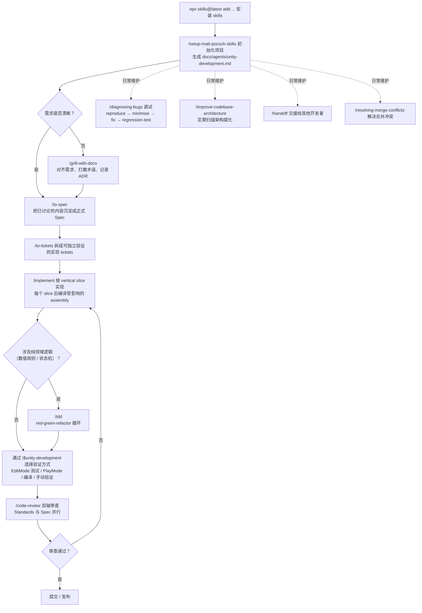

# Matt Pocock Agent Skills 中文 Unity 适配版

## 为什么需要这个中文版？

- 更好适配中文大语言模型
- 方便中文母语开发者
- 方便接入中文开发流程
- 为 Unity 的 assembly、Editor、scene/prefab、asset 与 PlayMode 验证提供专门工作流

## 关于这个中文版

这是 [`mattpocock/skills`](https://github.com/mattpocock/skills) 的简体中文 Unity 适配版本，延续 [`vinvcn/mattpocock-skills-zh-CN`](https://github.com/vinvcn/mattpocock-skills-zh-CN) 的中文本地化工作。除翻译外，本 fork 增加了 Unity implementation/verification workflow，并让 review、diagnosis、architecture、prototype、merge conflict 与 setup 流程识别 Unity 项目边界。目录名、技能名、命令、代码块、路径和工具标识保持不变，以免破坏安装和运行行为。

中文版本不只是为了阅读方便。对中文母语用户来说，中文说明能减少概念转换成本；对以中文为主要交互语言或中文语料优化的模型来说，中文 prompt 和 skill instructions 也更容易贴合中文上下文，减少中英混杂带来的歧义。

本仓库按内容刷新方式同步上游，不同步上游 Git 历史或仓库管理状态。维护规则见 [`.skills/translate-skill/SKILL.md`](./.skills/translate-skill/SKILL.md)。

本仓库的最近一次同步翻译由 ZCode（GLM coding agent）执行，并由仓库维护者通过提交记录纳入 `main`。翻译策略是 **skill-guided content localization**：把上游 `mattpocock/skills` 当作英文内容来源，只翻译自然语言说明，保留目录名、skill name、frontmatter key、命令、代码块、路径、URL、package/tool/API identifiers 和行为关键 labels。用户可见的安装路径统一保持为 `hi-fangj/unity-mattpocock-skills-zh-CN`。

### 同步日志

- 2026-08-29: Synced upstream `mattpocock/skills@6654f6b`，local commit `758bf2c`。全仓 prose 移除 em-dash 并把该政策写入 `CLAUDE.md`/`AGENTS.md`；统一跨 skill 调用为 `Call the Skill tool` 措辞，并改为转告人类运行 user-invoked skills（`/setup-matt-pocock-skills` 等），删除 `diagnosing-bugs` Phase 6 对 `/improve-codebase-architecture` 的交接；`grilling` 轮内问题以分隔线隔开；`domain-modeling` 触发条件放宽到术语讨论与 CONTEXT.md/ADR 编辑；`wait-what` 支持经 `CONTEXT-MAP.md` 定位多 context；新增 in-progress skills `implement-spec` 与 `retro`；YAML `description` 引号修复；README、docs 与各 bucket 索引同步刷新。

- 2026-08-11: Synced upstream `mattpocock/skills@84fdeff`，local commit `d525a18`。完整刷新 engineering/productivity 技能集：重译 `grilling`（rounds + frontier）、`prototype`（shareable HTML logic demo，保留 UNITY.md）、`diagnosing-bugs`（Redact）与 `wizard`（迁移到 engineering 并改为 model-invoked）；迁移 `to-questionnaire` 到 productivity；新增 `wait-what`、`writing-for-agents`（含 SKILL-MECHANICS）及 `ask-matt/PHASE-BOUNDARIES.md`；删除上游已移除的 `writing-great-skills` 与 `batch-grill-me`；同步其余 11 个 skill 的 spec 术语与措辞更新，并刷新全部索引。

## 30 秒安装

```bash
npx skills@latest add hi-fangj/unity-mattpocock-skills-zh-CN
```

选择你想安装的 skills，以及要安装到哪些 coding agents。Unity 项目首次安装时请确保选择 [`/setup-matt-pocock-skills`](./skills/engineering/setup-matt-pocock-skills/SKILL.md) 与 [`/unity-development`](./skills/engineering/unity-development/SKILL.md)，然后运行 setup 完成 issue tracker、labels、docs 与 Unity verification 配置。

[](https://skills.sh/hi-fangj/unity-mattpocock-skills-zh-CN)

<p>
  <a href="https://www.aihero.dev/s/skills-newsletter">
    <picture>
      <source media="(prefers-color-scheme: dark)" srcset="https://res.cloudinary.com/total-typescript/image/upload/v1777382277/skills-repo-dark_2x.png">
      <source media="(prefers-color-scheme: light)" srcset="https://res.cloudinary.com/total-typescript/image/upload/v1777382277/skill-repo-light_2x.png">
      
    </picture>
  </a>
</p>

## Unity 使用示例

以下是在 Unity 项目中日常使用这些 skills 的典型场景。所有示例均以中文与 agent 交互。

整体工作流如下：



> Mermaid 图表在 GitHub 上直接渲染；若你的 Markdown 预览器不支持，可把上方代码块内容粘贴到 [mermaid.live](https://mermaid.live) 查看。

### 1. 首次接入：初始化 Unity 项目

在 Unity 项目根目录下，先安装 skills，然后运行 setup：

```bash
npx skills@latest add hi-fangj/unity-mattpocock-skills-zh-CN
```

在 agent 中运行：

```
/setup-matt-pocock-skills
```

Setup 会自动检测 `ProjectSettings/ProjectVersion.txt` 识别 Unity 项目，并生成 `docs/agents/unity-development.md`，记录项目的 assembly 边界、生成代码目录、编译入口和高风险模块。完成后，后续所有 engineering skills 都会感知 Unity 项目约束。

---

### 2. 日常开发：实现新功能

假设你要给自走棋游戏添加一个新装备系统。

**第一步：对齐需求**

```
/grill-with-docs 我要给自走棋添加一个装备合成系统，玩家可以把三件相同品质的装备合成为一件更高品质的随机装备
```

Agent 会围绕你的想法追问：合成规则的三消还是三合一？品质跃升是一级还是可跨级？合成失败怎么处理？同时把讨论中明确的术语（如 "装备品质"、"合成配方"）写入 `CONTEXT.md`，把关键决策写入 `docs/adr/`。

**第二步：实现**

```
/implement 按照刚才讨论的装备合成系统，实现 Model 层的合成逻辑和 ModelView 层的合成面板 UI
```

Agent 会：
- 读取 `AGENTS.md` 确认架构边界（Model 放规则，ModelView 放 UI）
- 通过 `$unity-development` 选择正确的验证方式（纯 C# 编译 → EditMode 测试 → PlayMode 验证）
- 一次完成一个行为闭环，每个 slice 后编译受影响的 assembly
- 遵守生成代码只读约束，不手改 `Assets/Scripts/Model/Generate/` 下的文件

**第三步：代码审查**

```
/code-review
```

Agent 会从 Standards（是否符合 AGENTS.md 编码规范）和 Spec（是否符合装备合成需求）两个轴线并行审查变更。

---

### 3. 输出正式 Spec：把讨论沉淀成需求文档

如果你已经和 agent（或同事）把需求讨论清楚了，但产出的是对话而不是可交付的 spec，不想再走一轮访谈时：

```
/to-spec 把刚才讨论的装备合成需求整理成 spec 发布到 issue tracker
```

Agent **不做访谈**，只综合当前对话已经达成的共识，输出一份正式的 spec 并发布到配置好的 issue tracker（GitHub Issues / GitLab / `.scratch/` 本地 markdown）。

它和 `/grill-with-docs` 的区别：

- `/grill-with-docs`：边访谈边打磨需求，适合需求还不清晰、需要对齐的场景
- `/to-spec`：不做访谈，直接综合已有讨论，适合共识已经形成、只需要落成文档的场景

产出 spec 后，可以接着用 `/implement` 基于 spec 实现，或先用 `/code-review` 以 spec 为轴审查已有变更是否符合。

---

### 4. 调试 Bug：定位战斗回放不同步

当你遇到锁步战斗回放不一致的问题时：

```
/diagnosing-bugs 战斗回放时，第5回合的棋子位置和对战时不一致，应该是同步逻辑有问题
```

Agent 会按纪律化诊断循环推进：

1. **Reproduce**：确认问题在哪些回合/阵容下必现
2. **Minimise**：构造最小复现 case（例如只有两个棋子的简单对局）
3. **Hypothesise**：检查 `LS*` 锁步相关代码、事件序列化/反序列化
4. **Instrument**：在关键路径加日志，对比实时战斗和回放的 event stream
5. **Fix**：定位根因后修复
6. **Regression-test**：用复现 case 验证修复，并加入回归检查清单

因为涉及锁步逻辑（AGENTS.md 标记的高风险区域），agent 会同时检查逻辑侧和视图侧的一致性。

---

### 5. 架构治理：防止代码腐化

每隔几天运行一次架构扫描：

```
/improve-codebase-architecture
```

Agent 会扫描代码库寻找深化机会（deepening opportunities），生成可视化 HTML 报告。例如可能发现：

- Model 层混入了 UnityEngine 依赖 → 建议提取到 ModelView
- FairyGUI 生成包装类被手改 → 建议修改生成器源配置
- 多个 System 重复实现相似的资源加载逻辑 → 建议抽象到 Core 层

选中某个候选项后，agent 会继续追问帮你明确重构方案。

---

### 6. TDD：为领域逻辑写测试

当你要给 Model 层的数值规则加测试时：

```
/tdd 给棋子升级经验曲线写单元测试，验证从1星升2星需要10经验，2星升3星需要20经验
```

Agent 会走 red-green-refactor 循环：

1. **Red**：先写一个失败测试（因为升级逻辑可能还没实现或不正确）
2. **Green**：实现或修正代码让测试通过
3. **Refactor**：在测试保护下重构，消除重复、改善命名

因为是纯 C# 领域逻辑（不依赖 UnityEngine），可以直接用 `dotnet build` + EditMode test 快速验证，反馈循环很快。

---

### 7. 拆解大任务：规划复杂功能

当你有一个需要多步骤完成的大型功能时：

```
/wayfinder 我要实现一个完整的 PVP 匹配对战系统，包括匹配队列、段位计算、赛季结算
```

Agent 会在 issue tracker 上创建 decision tickets 地图，把大块工作拆成可独立推进的子任务，每个子任务声明 blocking edges（前置依赖）。你可以逐个解决，直到通往目标的路径完全清晰。

然后：

```
/to-tickets 把匹配对战系统的 plan 拆成实现 tickets
```

Agent 会把 plan 拆成 tracer-bullet tickets，每个 ticket 是一个小的、可独立验证的 vertical slice。

---

### 8. 合并冲突：解决 Unity 场景冲突

当多人同时修改同一个 Unity 场景导致 merge conflict 时：

```
/resolving-merge-conflicts
```

Agent 会逐个 hunk 处理冲突，追溯到各方的 primary source intent 来解决，而不是简单地 `--abort`。对 `.unity` 场景文件和 `.prefab` 文件（YAML 格式），agent 会小心处理 GameObject / Component 引用完整性。

---

### 9. 知识传承：交接给其他开发者

当你需要把当前工作交接给同事时：

```
/handoff
```

Agent 会把当前对话压缩成交接文档，包含：当前进度、已做出的关键决策、待解决的问题、下一步计划。另一位开发者用 agent 加载交接文档后即可继续。

---

## 原版 README 翻译

我每天用于真实工程工作的 agent skills，不是 vibe coding。

开发真实应用很难。GSD、BMAD、Spec-Kit 这类方法试图通过接管流程来帮你。但它们在接管流程的同时，也拿走了你的控制权，并让流程里的 bug 更难解决。

这些 skills 被设计得小、易改、可组合。它们适用于任何模型，背后是数十年的工程经验。你可以 hack 它们，让它们变成自己的东西。

如果你想跟进这些 skills 的更新，以及我后续创建的新 skill，可以加入大约 60,000 名开发者订阅的 newsletter：

[订阅 Newsletter](https://www.aihero.dev/s/skills-newsletter)

### Quickstart（30 秒 setup）

1. 运行 skills.sh installer：

```bash
npx skills@latest add hi-fangj/unity-mattpocock-skills-zh-CN
```

2. 选择你想安装的 skills，以及要安装到哪些 coding agents。Unity 项目**确保选择 `/setup-matt-pocock-skills` 与 `/unity-development`**。

3. 在你的 agent 中运行 `/setup-matt-pocock-skills`。它会：
   - 询问你要使用哪个 issue tracker（GitHub、Linear 或 local files）
   - 询问你 triage issues 时使用哪些 labels（`/triage` 会使用这些 labels）
   - 询问要把创建的 docs 保存到哪里
   - 检测 Unity 项目并记录 assembly、generated-code ownership、compiler checks 与 Unity-facing verification paths

4. 完成后即可开始使用。

### 作为 Claude Code plugin 安装

如果你更喜欢无需手动维护的即装即用方式，这些 skills 也以原生 [Claude Code plugin](https://code.claude.com/docs/en/plugins) 发布。与把可编辑文件复制进 repo 不同，plugin 会把整套 skills 安装为受管理的 bundle；新版本发布后可以统一更新。

在 Claude Code 中运行：

```
/plugin marketplace add hi-fangj/unity-mattpocock-skills-zh-CN
/plugin install mattpocock-skills@mattpocock
```

或在 shell 中运行：

```bash
claude plugin marketplace add hi-fangj/unity-mattpocock-skills-zh-CN
claude plugin install mattpocock-skills@mattpocock
```

然后像上面的 quickstart 一样，在每个 repo 中运行一次 `/setup-matt-pocock-skills`。

两种安装方式代表两种使用取向：

- **[skills.sh](https://skills.sh/hi-fangj/unity-mattpocock-skills-zh-CN)** 会把 skills 复制进项目，方便你修改并定制。
- **Plugin** 把它们作为受管理的只读 bundle 安装，适合只想直接使用并持续跟进更新的用户。

> 使用 Codex 或其他 agent？[skills.sh installer](https://skills.sh/hi-fangj/unity-mattpocock-skills-zh-CN) 已经可以把这些 skills 安装到 Codex 和其他兼容 Agent Skills 的 harnesses；目前尚未提供原生 Codex plugin。

### 为什么这些 Skills 存在

我创建这些 skills，是为了解决我在 Claude Code、Codex 和其他 coding agents 中反复看到的常见失败模式。

#### #1: Agent 没有做我想要的东西

> "No-one knows exactly what they want"
>
> David Thomas & Andrew Hunt, [The Pragmatic Programmer](https://www.amazon.co.uk/Pragmatic-Programmer-Anniversary-Journey-Mastery/dp/B0833F1T3V)

**问题**：软件开发中最常见的失败模式是 misalignment。你以为开发者理解了你想要什么；等看到做出来的东西，才发现对方完全没理解。

AI 时代也是一样。你和 agent 之间存在沟通缺口。修复方式是一次 **grilling session**，让 agent 针对你要构建的东西提出详细问题。

**解决方式**是使用：

- [`/grill-me`](./skills/productivity/grill-me/SKILL.md) - 用于非代码场景
- [`/grill-with-docs`](./skills/engineering/grill-with-docs/SKILL.md) - 与 [`/grill-me`](./skills/productivity/grill-me/SKILL.md) 类似，但会加入更多文档能力（见下文）

这些是我最常用的 skills。它们帮助你在开始前和 agent 对齐，并深入思考你要做的变更。每次想做变更时都值得使用。

#### #2: Agent 太啰嗦

> With a ubiquitous language, conversations among developers and expressions of the code are all derived from the same domain model.
>
> Eric Evans, [Domain-Driven-Design](https://www.amazon.co.uk/Domain-Driven-Design-Tackling-Complexity-Software/dp/0321125215)

**问题**：项目开始时，开发者和真正使用软件的人（domain experts）通常说着不同语言。

我在 agents 身上也感受到同样张力。Agents 往往被丢进一个项目，然后被要求边做边弄懂术语。于是它们用 20 个词解释本来 1 个词就够的东西。

**解决方式**是 shared language。它是一份帮助 agents 解码项目术语的文档。

<details>
<summary>
示例
</summary>

这是我 `course-video-manager` repo 中的一个 [`CONTEXT.md`](https://github.com/mattpocock/course-video-manager/blob/076a5a7a182db0fe1e62971dd7a68bcadf010f1c/CONTEXT.md) 示例。哪一个更容易读？

- **BEFORE**: "There's a problem when a lesson inside a section of a course is made 'real' (i.e. given a spot in the file system)"
- **AFTER**: "There's a problem with the materialization cascade"

这种简洁性会在一次又一次 session 中持续回报。

</details>

这已经内置在 [`/grill-with-docs`](./skills/engineering/grill-with-docs/SKILL.md) 中。它是一场 grilling session，同时帮助你和 AI 建立 shared language，并把难解释的决策记录到 ADR 中。

很难解释这件事有多强。它可能是这个 repo 里最酷的技术之一。试试看就知道。

> [!TIP]
> Shared language 除了减少啰嗦，还有很多其他好处：
>
> - **变量、函数和文件命名更一致**，因为都使用 shared language
> - 因此 **agent 更容易浏览 codebase**
> - Agent 也会 **花更少 tokens 思考**，因为它能使用更简洁的语言

#### #3: 代码跑不起来

> "Always take small, deliberate steps. The rate of feedback is your speed limit. Never take on a task that’s too big."
>
> David Thomas & Andrew Hunt, [The Pragmatic Programmer](https://www.amazon.co.uk/Pragmatic-Programmer-Anniversary-Journey-Mastery/dp/B0833F1T3V)

**问题**：假设你和 agent 已经对要构建什么达成一致。那如果 agent 仍然产出一堆不能用的东西呢？

这时要看你的 feedback loops。没有对生成代码真实运行情况的反馈，agent 就是在盲飞。

**解决方式**：你需要常规的一组 feedback loops：static types、browser access 和 automated tests。

对 automated tests 来说，red-green-refactor 循环非常关键。Agent 先写一个失败测试，再修到测试通过。这能给 agent 稳定反馈，最终得到更好的代码。

我做了一个可以放进任何项目的 **[`/tdd`](./skills/engineering/tdd/SKILL.md) skill**。它鼓励 red-green-refactor，并给 agent 足够多关于好测试和坏测试的指导。

调试方面，我也做了一个 **[`/diagnosing-bugs`](./skills/engineering/diagnosing-bugs/SKILL.md)** skill，把最佳调试实践包装成一个简单循环。

#### #4: 我们做出了 Ball Of Mud

> "Invest in the design of the system _every day_."
>
> Kent Beck, [Extreme Programming Explained](https://www.amazon.co.uk/Extreme-Programming-Explained-Embrace-Change/dp/0321278658)

> "The best modules are deep. They allow a lot of functionality to be accessed through a simple interface."
>
> John Ousterhout, [A Philosophy Of Software Design](https://www.amazon.co.uk/Philosophy-Software-Design-2nd/dp/173210221X)

**问题**：大多数用 agents 构建的应用都复杂且难以修改。因为 agents 能极大加速编码，它们也会以空前速度加速软件熵增。Codebase 会变得越来越复杂。

**解决方式**是 AI-powered development 的一种新办法：关心代码设计。

这些 skills 的每一层都内置了这种思路：

- [`/to-spec`](./skills/engineering/to-spec/SKILL.md) 会在创建 spec 前追问你准备改动哪些 modules

更重要的是，[`/improve-codebase-architecture`](./skills/engineering/improve-codebase-architecture/SKILL.md) 能帮助你拯救已经变成 ball of mud 的 codebase。我建议每隔几天就在你的 codebase 上跑一次。

#### Summary

软件工程基本功比以往任何时候都更重要。这些 skills 是我把这些基本功压缩成可重复实践的一次尝试，目标是帮你交付职业生涯中最好的应用。

### Reference

这些 skills 按一个维度区分：谁能调用它们。**User-invoked** skills 只有在你输入名称时才能触达（例如 `/grill-me`）；它们的工作是编排。**Model-invoked** skills 可以由你调用，也可以在任务匹配时由 agent 自动触达；它们承载可复用纪律。User-invoked skill 可以调用 model-invoked skills，但不能调用另一个 user-invoked skill。

#### Engineering

我每天用于代码工作的 skills。

**User-invoked**

- **[ask-matt](./skills/engineering/ask-matt/SKILL.md)**：询问当前情境适合哪个 skill 或 flow；它是本仓库 user-invoked skills 的 router。
- **[grill-with-docs](./skills/engineering/grill-with-docs/SKILL.md)**：追问式访谈，同时构建项目的 domain model、打磨术语，并内联更新 `CONTEXT.md` 与 ADRs。
- **[triage](./skills/engineering/triage/SKILL.md)**：通过 triage roles state machine 推进 issues。
- **[improve-codebase-architecture](./skills/engineering/improve-codebase-architecture/SKILL.md)**：扫描 codebase 中的 deepening opportunities，生成可视化 HTML report，然后围绕你选中的候选项继续 grilling。
- **[setup-matt-pocock-skills](./skills/engineering/setup-matt-pocock-skills/SKILL.md)**：配置 issue tracker、triage labels、domain docs，以及适用时的 Unity development workflow。每个 repo 运行一次。
- **[to-spec](./skills/engineering/to-spec/SKILL.md)**：把当前对话整理成 spec 并发布到 issue tracker。不做访谈，只综合已经讨论过的内容。
- **[to-tickets](./skills/engineering/to-tickets/SKILL.md)**：把 plan、spec 或 conversation 拆成 tracer-bullet tickets，每个 ticket 声明 blocking edges，在 local file 中写成文本，或在真实 tracker 上写成 native blocking links。
- **[wayfinder](./skills/engineering/wayfinder/SKILL.md)**：把超出单个 agent session 的大块工作规划成 issue tracker 上的 decision tickets 共享 map，逐一解决直到通往 destination 的路清晰。
- **[implement](./skills/engineering/implement/SKILL.md)**：基于 spec 或 ticket 集合实现一段工作，在预先约定的 seams 处驱动 `/tdd`，并在提交前以 `/code-review` 收尾。

**Model-invoked**

- **[unity-development](./skills/engineering/unity-development/SKILL.md)**：为 Unity C#、assemblies、MonoBehaviours、scenes、prefabs、Editor tooling、assets、UI 与 deterministic gameplay 选择忠实的实现和验证循环。
- **[prototype](./skills/engineering/prototype/SKILL.md)**：构建 throwaway prototype，回答 state/business-logic 问题（单文件 shareable HTML demo）或探索 UI 变体。
- **[wizard](./skills/engineering/wizard/SKILL.md)**：生成一个交互式 bash wizard，引导人完成只有他们才能执行的步骤：provisioning infrastructure、设置 credentials 或 CI secrets、操作陌生第三方 dashboard，或运行一次性 migration 或 cutover。
- **[diagnosing-bugs](./skills/engineering/diagnosing-bugs/SKILL.md)**：面向棘手 bug 和性能回退的纪律化诊断循环：reproduce -> minimise -> hypothesise -> instrument -> fix -> regression-test。
- **[research](./skills/engineering/research/SKILL.md)**：对照 high-trust primary sources 调研问题，并把带引用的 findings 保存为 Markdown 文件。
- **[tdd](./skills/engineering/tdd/SKILL.md)**：使用 red-green-refactor 循环做 test-driven development；一次一个 vertical slice 地构建功能或修复 bug。
- **[domain-modeling](./skills/engineering/domain-modeling/SKILL.md)**：主动构建和打磨项目 domain model：挑战术语、用 edge-case scenarios 做压力测试，并内联更新 `CONTEXT.md` 与 ADRs。
- **[codebase-design](./skills/engineering/codebase-design/SKILL.md)**：设计 deep modules 的共享纪律和词汇：小 interface、clean seam、通过 interface 测试。
- **[code-review](./skills/engineering/code-review/SKILL.md)**：对 fixed point 以来的 diff 做双轴 review：Standards 与 Spec 分开检查，并用并行 sub-agents 运行。
- **[resolving-merge-conflicts](./skills/engineering/resolving-merge-conflicts/SKILL.md)**：逐个 hunk 处理正在进行的 git merge/rebase conflict，按追溯到各方 primary source 的 intent 解决，然后完成操作，绝不 `--abort`。

#### Productivity

通用工作流工具，不限于代码。

**User-invoked**

- **[grill-me](./skills/productivity/grill-me/SKILL.md)**：围绕计划或设计持续追问，直到 decision tree 的每个分支都被解决。
- **[handoff](./skills/productivity/handoff/SKILL.md)**：把当前对话压缩成 handoff document，让另一个 agent 可以继续。
- **[teach](./skills/productivity/teach/SKILL.md)**：使用当前目录作为 stateful teaching workspace，在多个 sessions 中教用户一个新 skill 或概念。
- **[to-questionnaire](./skills/productivity/to-questionnaire/SKILL.md)**：把你无法独自回答的 decision 转成一份 Markdown questionnaire，交给唯一能回答的那个人（异步填写，或在会议中一起填写）。
- **[wait-what](./skills/productivity/wait-what/SKILL.md)**：当一条消息没有落地时触发它。agent 会用你缺失的 context、用平实的语言、用你的 `CONTEXT.md` 词汇重新表述。
- **[writing-for-agents](./skills/productivity/writing-for-agents/SKILL.md)**：编写供 agents 消费的文档：skills、AGENTS.md/CLAUDE.md，以及任何 agent 通过 pointer 到达的 doc。

**Model-invoked**

- **[grilling](./skills/productivity/grilling/SKILL.md)**：围绕计划、decision 或 idea 按轮次持续访谈用户，直到 design tree 的每个分支都被解决。它是 `grill-me` 和 `grill-with-docs` 背后的 reusable loop。

#### Misc

本地保留但很少使用的工具。

**User-invoked**

- 当前没有 user-invoked skills。

**Model-invoked**

- **[git-guardrails-claude-code](./skills/misc/git-guardrails-claude-code/SKILL.md)**：设置 Claude Code hooks，在危险 git 命令（push、reset --hard、clean 等）执行前阻止它们。
- **[migrate-to-shoehorn](./skills/misc/migrate-to-shoehorn/SKILL.md)**：将测试文件中的 `as` 类型断言迁移到 @total-typescript/shoehorn。
- **[scaffold-exercises](./skills/misc/scaffold-exercises/SKILL.md)**：创建包含 sections、problems、solutions 和 explainers 的练习目录结构。
- **[setup-pre-commit](./skills/misc/setup-pre-commit/SKILL.md)**：设置 Husky pre-commit hooks，集成 lint-staged、Prettier、type checking 和 tests。
