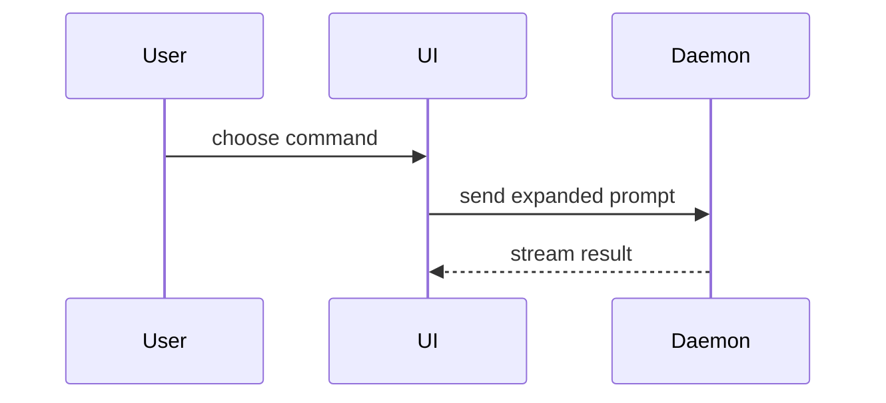

写 PR body 时使用这个模板：

```markdown
## Summary

<diagram, diff-sketch, or tree>

## Evidence

- **Before:** <screenshot/output/failing test run>
  **After:** <screenshot/output/passing test run>

## Merge Danger

**Door:** <one-way or two-way>

<optional: description>

**Blast Radius:** <one-word description>

<optional: potential ramifications of merge>
```

## Sections

跳过所有 preamble，prose 保持简短。使用 `GLOSSARY.md` 中用户的 domain language。

### Summary

选择能把关键点讲清楚的最小视图。

- 用 pseudocode 展示 logic 或算法：

```text
on(save)
  if content is unchanged
    return cached result
  write new content
  return fresh result
```

- 用 call tree 展示 runtime control flow：

```text
submitForm
  createSession
    persistPrompt
    launchAgent
  navigateToSession
```

- 用 component tree 展示 UI 结构，包括重要的 state 和 module boundaries：

```text
<SessionPage> (apps/example/src/routes/session.tsx)
  useSessionEvents()
  <SessionToolbar>
    <RunSkillButton> (packages/ui)
```

- 用浅层 file tree 展示文件职责或大范围 refactor：

```text
src/
├── commands/       # parses user actions
├── sessions/       # owns session state
└── transport/      # sends API requests
```

- 用 Mermaid 展示 component 交互、control flow 或 data flow：



- 当重点在于“什么变了”且周围结构已经存在时，使用 `diff`。让 diff 的形状匹配主题。

Component 变更：

```diff
 <SessionPage>
   useSessionEvents()
   <SessionToolbar>
+    <RunSkillButton />
   <SessionTimeline>
+    <SkillResultCard />
```

文件布局变更：

```diff
 src/
 ├── commands/
+│   └── show-me.ts       # expands the slash command
 ├── sessions/
-└── transport.ts
+└── transport/
+    ├── client.ts
+    └── stream.ts
```

call tree 或 call stack 变更：

```diff
 submitForm
   createSession
     persistPrompt
+    expandSkillMention
     launchAgent
-  navigateToSession
+  navigateToSession
+    subscribeToEvents
```

state 或 control-flow 变更：

```diff
 on(save)
-  write content
+  if content is unchanged
+    return cached result
+  write new content
+  invalidate cache
```

- 当大部分内容都是新的、省略上下文会掩盖 ownership 或顺序、或用户需要可复制的目标形状时，展示整个 block：

```ts
function expandSkill(command: string): string {
  const skillName = command.slice(1);
  return `use the ${skillName} skill`;
}
```

#### Guidance

把每个 visual 放在它支撑的短文本旁边。只保留能回答用户当前问题所需的 calls、files、props、states 和 boundaries，以及能解决当前讨论点的选项。

你可以只用其中一种，也可以用几种，不太可能全部用上。运用 judgement，不要让用户被信息淹没。

### Evidence

变更确实可用的具体证据。展示 before 和 after。

Screenshot 是 S 级：环境支持且变更可视觉呈现时使用。

基于执行的证据是 A 级：test results、console output。用 pseudocode 展示现在失败和通过的那条确切 test。

### Merge Danger

说明这是 one-way door 还是 two-way door。Two-way doors 可以走回来，one-way doors 不行。回滚便宜的 PR 风险更低。涉及破坏性操作或难以逆转的 decisions 的变更属于 one-way doors。

Blast radius 是这个 PR 引入变更的潜在影响或波及范围。考虑所有可能性：layout shift、consumer 端 breakage、mobile responsiveness 等。
